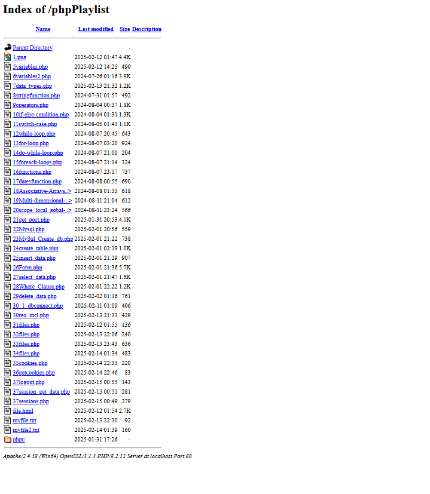
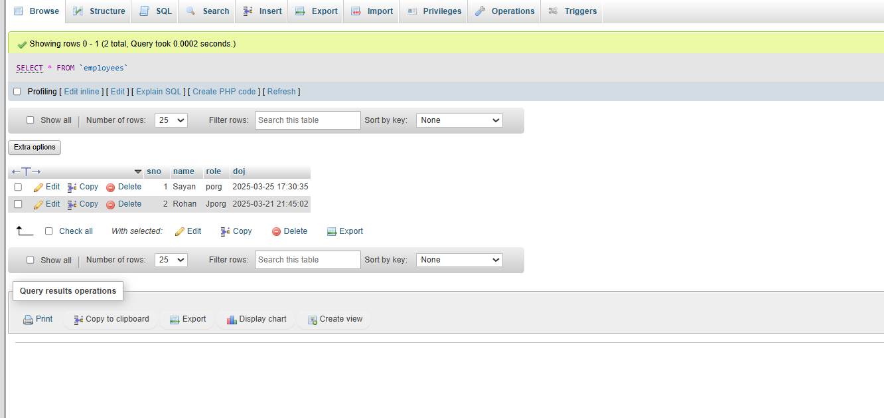
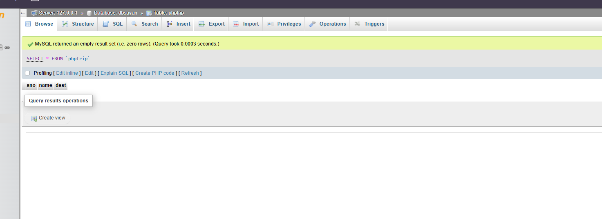

# 🐘 Basic to Intermediate PHP Programs

This repository contains a wide range of PHP programs covering **basic syntax**, **control structures**, **functions**, **arrays**, **form handling**, **superglobals**, and **MySQL integration**.  
It's designed to help beginners and intermediate learners practice and strengthen their PHP fundamentals.

---

## 📁 Project Structure
├──PHPPlaylist <br>
   ├──phppt/<br>
├── dir/<br>
│ ├── 1sayan.php<br>
│ └── 2sayan.php<br>
├── dir0/<br>
│ └── ...<br>
├── dir1/<br>
│ ├── 3index.php<br>
│ └── ...<br>
├── dir2/<br>
│ └── 4index.php<br>
├── dir3/<br>
│ ├── Indexboot.php<br>
│ ├── 01-variables.php<br>
│ ├── 06-variable2.php<br>
│ ├── 07datatypes.php<br>
│ ├── ...<br>
│ ├── 21get_post.php<br>
│ ├── 22MySql_Create_db.php<br>
│ ├── 23create_table.php<br>
│ ├── 25insert_data.php<br>
│ ├── 26Form.php<br>
│ ├── ...<br>
│ ├── 30.1_dbconnect.php<br>
│ ├── 31read.php<br>
│ ├── 32files.php<br>
│ ├── 36cookies.php<br>
│ ├── 39logout.php<br>
│ └── 40session_get_data.php<br>


---

## ✨ Features

- ✅ Covers PHP basics to MySQL CRUD
- ✅ Form handling using `$_POST`, `$_GET`
- ✅ Working with arrays (single & multidimensional)
- ✅ Functions, loops, and conditionals
- ✅ File operations, cookies & sessions
- ✅ MySQL integration with `mysqli`

---

## ⚙️ Requirements

- PHP 7.0 or later
- XAMPP / WAMP / Laragon or any local server
- Browser to run `.php` files
- MySQL (for DB-related programs)

---

## 🚀 How to Run

1. Download or clone the repository:
   ```bash
   git clone https://github.com/Sayan-AdhikaryM10/phpPlaylist
    ```

2. Place the folder in your web root:

    - For XAMPP: `C:\xampp\htdocs\`
    - For WAMP: `C:\wamp64\www\`
    - For Laragon: `C:\laragon\www\`

3. Start your local server (XAMPP/WAMP/Laragon).

4. Open your browser and navigate to:
   ```
   http://localhost/phpPlaylist/
   ```
5. For database-related programs:
    - Create a database named `phpPlaylist` in your MySQL server.
    - Import the SQL files provided in the `MySQL` directory to set up tables.

| Topic                  | Files                                                                                    |
| ---------------------- | ---------------------------------------------------------------------------------------- |
| Variables & Data Types | `01-variables.php`, `07datatypes.php`                                                    |
| Conditionals           | `10if-else-condition.php`, `11switch-case.php`                                           |
| Loops                  | `12while-loop.php`, `13for-loop.php`                                                     |
| Arrays                 | `14one-array.php`, `18associative-array.php`                                             |
| Functions              | `16functions.php`, `17returnfunction.php`                                                |
| Superglobals           | `21get_post.php`, `26Form.php`, `27set_data.php`                                         |
| File Handling          | `32files.php`, `33files.php`                                                             |
| Cookies & Sessions     | `36cookies.php`, `37getcookies.php`, `39logout.php`, `40session_get_data.php`            |
| MySQL                  | `22MySql_Create_db.php`, `23create_table.php`, `25insert_data.php`, `30.1_dbconnect.php` |


📷 Screenshots





---


## 🧠 Learning Outcome

This repo is ideal for:

Students practicing PHP assignments

Beginners who want structured learning

Anyone preparing for PHP interviews


## 📌 Future Plans
 Add basic OOP in PHP

 Add examples using PDO

 Build a mini CRUD web app


## 🤝 Contributing
Feel free to contribute to this project by submitting pull requests. Your contributions are valuable and appreciated.

## 📜 License

This project is licensed under the MIT License - see the [LICENSE](LICENSE) file for details.


🧑‍💻 Author
Sayan Adhikary
Beginner PHP Developer | Web Enthusiast

GitHub: Sayan-AdhikaryM10

LinkedIn: [Sayan Adhikary](https://www.linkedin.com/in/sayan-adhikary-088a34270/)

